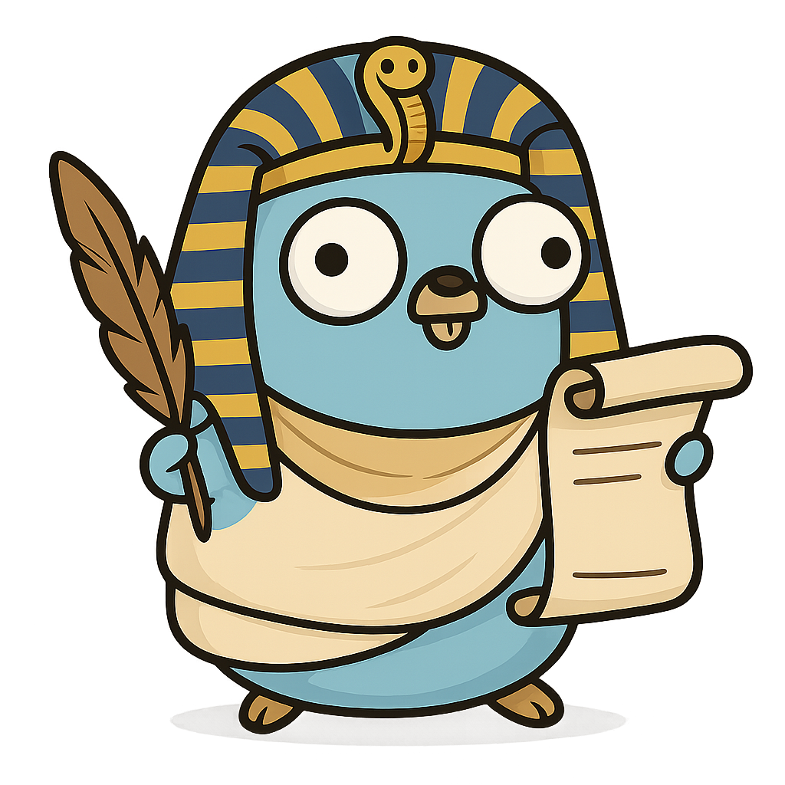

# Thoth (Go)
<p align="center">

</p>

A language agnostic tool for turning TODO lines / comments in a code base into open Github issues.

## 🚀 Features

- Finds all the TODO lines in the current folder 
- Finds all the open issues in your github - using git remote 
- Checks to see whether or not the issue is in github 
    - If it is not on GitHub in will add a issue number to the start of the todo line
    - If it is on GitHub it will ignore the issue 

## 🛠️ Prerequisites

- [Go](https://golang.org/dl/) installed (version 1.16+ recommended)
- A github token for the repository with permission to read / edit issues 
    - [Github Documentation](https://docs.github.com/en/authentication/keeping-your-account-and-data-secure/managing-your-personal-access-tokens#creating-a-fine-grained-personal-access-token)

        1. Verify your email address, if it hasn't been verified yet.
        2. In the upper-right corner of any page on GitHub, click your profile photo, then click settings.
        3. In the left sidebar, click Developer settings.
        4. In the left sidebar, under Personal access tokens, click Fine-grained tokens.
        5. Click Generate new token.
        6. Under Token name, enter a name for the token.
        7. Under Expiration, select an expiration for the token. Infinite lifetimes are allowed but may be blocked by a maximum lifetime policy set by your organization or enterprise owner. For more information, See Enforcing a maximum lifetime policy for personal access tokens.
            i. Optionally, under Description, add a note to describe the purpose of the token.
            ii. Optionally, if the resource owner is an organization that requires approval for fine-grained personal access tokens, below the resource owner, in the box, enter a justification for the request.
        9. Under Repository access, select which repositories you want the token to access. You should choose the minimal repository access that meets your needs. Tokens always include read-only access to all public repositories on GitHub.
        10. If you selected Only select repositories in the previous step, under the Selected repositories dropdown, select the repositories that you want the token to access.
        11. Under Permissions, select which permissions to grant the token. Depending on which resource owner and which repository access you specified, there are repository, organization, and account permissions. You should choose the minimal permissions necessary for your needs.

## 📁 Setup

1. Clone this repository:

   ```bash
   git clone https://github.com/jonathon-chew/Thoth.git
   cd Thoth 
   ```

2. Compile the script:

    `go build .`

## 📂 Output

This will make Github issues for you automatically and edit your codebase - just the todo line, to save the number of the issue for easily finding which issue is the right issue.

## 🧠 Notes

This is inspired by the project here: https://github.com/tsoding/snitch

## 📜 License

This project is licensed under the MIT License. See the LICENSE file for details.
